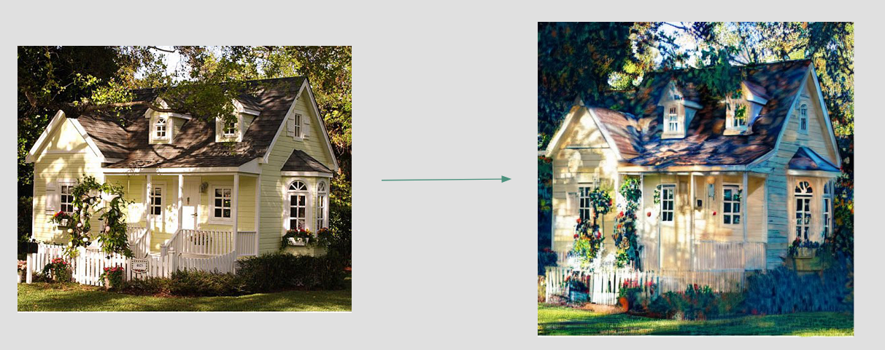

# Training-Free Style Transfer with Guided Diffusion

Transfer artistic styles to images using training-free guidance in pre-trained diffusion models. This project adapts the training-free guidance framework to perform style transfer by starting from an input image and applying a target artistic style without any model fine-tuning.


*Example: Input image transformed using Van Gogh's "The Starry Night" style*

## Overview

This implementation focuses on the **style transfer task** from the training-free guidance framework. Unlike traditional diffusion-based generation that starts from random noise, this approach:

-  Starts from your input image
-  Applies target artistic style (e.g., Van Gogh, Monet)
-  Uses pre-trained unconditional diffusion models
-  Requires no training or fine-tuning
-  Produces deterministic, controllable results

## How It Works

### The Process

1. **Extract Target Style Features**
   - Target style image is passed through a VGG-based style predictor
   - Style features are extracted using Gram matrices of CNN features
   - These capture textures, colors, and artistic patterns

2. **Guided Diffusion Sampling**
   
   At each denoising step `t`:
   - Start with current noisy image `x_t`
   - Diffusion model predicts next state `x_{t-1}`
   - Extract style features from current prediction
   - Compare with target style features and compute style loss
   - Apply TFG framework:
     - **Mean guidance**: Adjusts prediction direction toward target style
     - **Variance guidance**: Controls noise addition for style consistency
     - **Recurrent refinement**: Iteratively improves style matching
   - Update `x_{t-1}` to better match target style

3. **Output Generation**
   - After all denoising steps, output is your input image in the target artistic style
   - Unlike standard DDPM (random output each run), this produces consistent, style-transferred results

### Key Modifications

This project modifies the original framework to:
- Initialize diffusion from an input image (not random noise)
- Focus specifically on style transfer (not other guidance tasks)
- Provide deterministic style application to content images

## Installation
```bash
# Clone the repository
git clone https://github.com/rozhanvassef/training-free-style-transfer.git
cd training-free-style-transfer

# Create virtual environment (optional but recommended)
python -m venv venv
source venv/bin/activate  # On Windows: venv\Scripts\activate

# Install dependencies
pip install -r requirements.txt
```

## Usage

### Basic Style Transfer

Run the style transfer script:
```bash
bash scripts/style_transfer.sh
```

### Custom Configuration

Edit `scripts/style_transfer.sh` to specify:
- Input image path
- Target style image path
- Guidance strength parameters
- Number of diffusion steps

## Reference

This implementation is based on the paper:

**TFG: Unified Training-Free Guidance for Diffusion Models**  
Gruver et al., 2024  
[arXiv:2409.15761](https://arxiv.org/abs/2409.15761)


## Acknowledgments

This project adapts the Training-Free Guidance (TFG) framework specifically for image style transfer, modifying the original approach to work with content-preserving style application.
